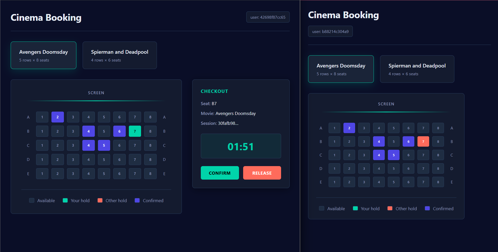
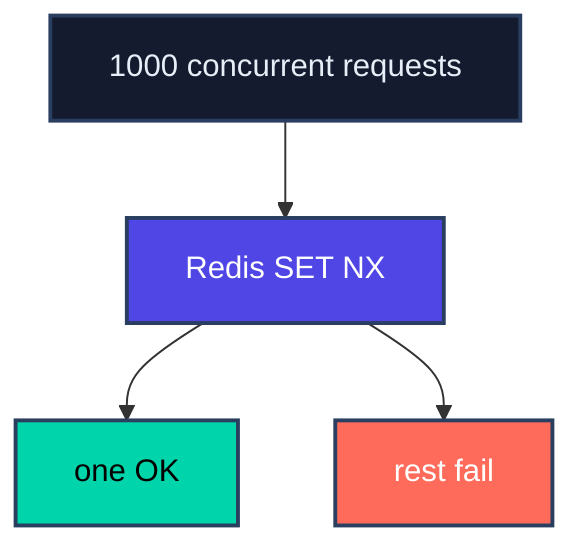
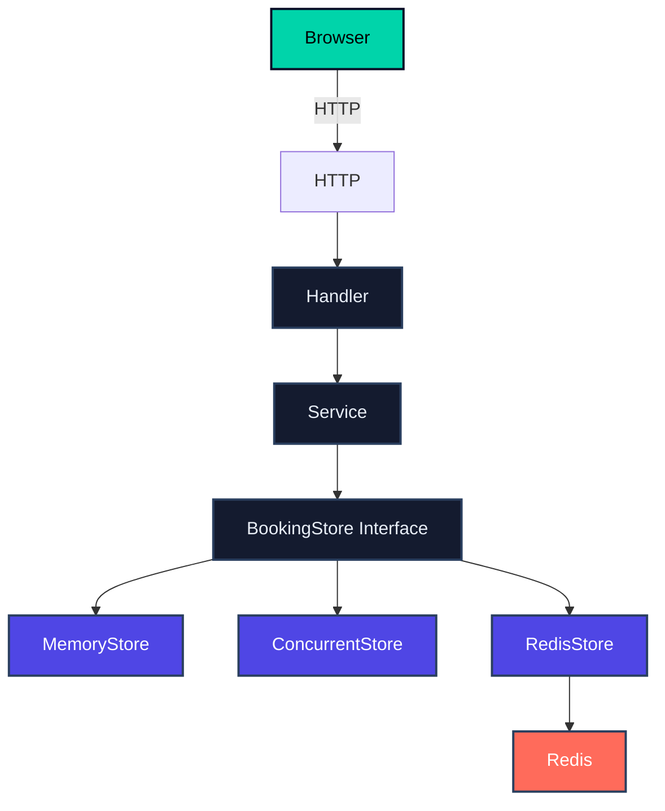
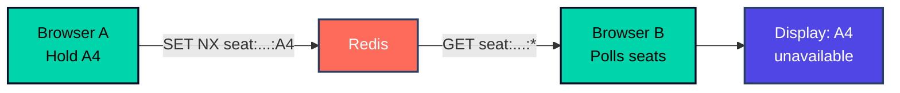

# Concurrent Cinema Booking



A Go-based cinema seat-booking system built to demonstrate **double booking, concurrency control, and atomic seat reservation**.

## Problem: Double Booking

The central problem is preventing two users from successfully booking the same seat at the same time.

A naive flow looks like:

```
User A -> check A1 -> available
User B -> check A1 -> available
User A -> book A1
User B -> book A1
```

The check and the booking must therefore be treated as one atomic operation.

The project demonstrates three progressively stronger solutions:

1. **Memory Store** — simple in-memory baseline
2. **Concurrency Solution** — mutex-protected in-memory store
3. **Redis Solution** — shared Redis storage with atomic `SET NX`, temporary holds, confirmation, and release

---

## 1. Memory Store

The first implementation stores bookings in a Go map:

```go
type MemoryStore struct {
    bookings map[string]Booking
}
```

The basic operation checks whether the seat exists and then inserts it:

```go
if _, exists := s.bookings[b.SeatID]; exists {
    return ErrSeatAlreadyBooked
}

s.bookings[b.SeatID] = b
```

This is useful as a simple baseline, but it is **not safe for concurrent booking requests**. The map and the check-then-insert sequence are not protected by synchronization.

The important lesson is that checking whether a seat is free and reserving it cannot be treated as two independent operations when requests can run concurrently.

---

## 2. Concurrency Solution

The second implementation keeps the bookings in memory but protects them with a Go `sync.RWMutex`:

```go
type ConcurrentStore struct {
    bookings map[string]Booking
    sync.RWMutex
}
```

Booking acquires a write lock:

```go
func (s *ConcurrentStore) Book(b Booking) error {
    s.Lock()
    defer s.Unlock()

    if _, exists := s.bookings[b.SeatID]; exists {
        return ErrSeatAlreadyBooked
    }

    s.bookings[b.SeatID] = b
    return nil
}
```

This makes the check-and-insert operation exclusive:

```
User A -> LOCK -> check -> book -> UNLOCK
User B -> LOCK -> check -> already booked -> UNLOCK
```

`ListBookings` uses `RLock`, allowing safe concurrent reads.

### Limitation

The mutex protects only the memory inside one Go process. If the application runs as multiple instances, each instance has its own map and its own mutex. The instances cannot coordinate bookings with each other.

---

## 3. Redis Solution

The third implementation uses Redis as shared storage.

The Redis key design is:

```
seat:{movieID}:{seatID} -> booking/session JSON
session:{sessionID}      -> seat key
```

The critical operation is Redis `SET` with `NX`:

```go
s.rdb.SetArgs(ctx, key, val, redis.SetArgs{
    Mode: "NX",
    TTL:  defaultHoldTTL,
})
```

`NX` means the key is created only if it does not already exist.

Therefore, concurrent requests for the same seat are resolved atomically by Redis:



This provides the concurrency guarantee required by the booking system.

### Temporary Seat Holds

A successful reservation initially has status `held` with a default TTL of **2 minutes**.

If the user does not confirm the booking, Redis automatically expires the seat key and the seat becomes available again.

### Confirmation

When a user confirms a held session, the Redis TTL is removed using `PERSIST` and the booking status becomes `confirmed`. The seat therefore remains booked permanently.

### Release

A user can release a held session. The seat key and session key are deleted, making the seat available again.

---

# Architecture



The common abstraction is:

```go
type BookingStore interface {
    Book(b Booking) (Booking, error)
    ListBookings(movieID string) []Booking
    Confirm(ctx context.Context, sessionID string, userID string) (Booking, error)
    Release(ctx context.Context, sessionID string, userID string) error
}
```

This allows the service layer to use different storage implementations without changing the HTTP API.

---

# Web API

The server runs on `http://localhost:8080`.

### `GET /movies`

Returns the available movies and their seat layout.

**Response:**
```json
[
  {
    "id": "Avengers Doomsday",
    "title": "Avengers Doomsday",
    "rows": 5,
    "seats_per_row": 8
  }
]
```

### `GET /movies/{movieID}/seats`

Returns the current booking status of seats for a movie.

**Response:**
```json
[
  {
    "seat_id": "A4",
    "user_id": "f96018f7c178",
    "booked": true,
    "confirmed": false
  }
]
```

The frontend uses these states to display:
- **Available** — gray
- **Your hold** — cyan
- **Other user's hold** — coral
- **Confirmed** — indigo

### `POST /movies/{movieID}/seats/{seatID}/hold`

Temporarily holds a seat.

**Request:**
```json
{
  "user_id": "f96018f7c178"
}
```

**Response:**
```json
{
  "session_id": "4ba10978-...",
  "movieID": "Avengers Doomsday",
  "seat_id": "A4",
  "expires_at": "..."
}
```

### `PUT /sessions/{sessionID}/confirm`

Confirms a held seat, making the booking permanent.

**Request:**
```json
{
  "user_id": "f96018f7c178"
}
```

### `DELETE /sessions/{sessionID}`

Releases a held seat, making it available again.

**Request:**
```json
{
  "user_id": "f96018f7c178"
}
```

---

# Frontend

The project includes a browser UI for the complete booking flow:

- Movie selection
- Seat layout with real-time availability
- Two-minute hold timer
- Confirm or release bookings
- Visual seat state indicators
- Live polling for changes from other users

The browser polls the seat endpoint every 2 seconds so that separate browser sessions can observe booking changes:



---

# Concurrency Test

The project includes a concurrency test that launches **1,000 goroutines** attempting to book the same seat.

The expected result is:

```
Successful bookings: 1
Failed bookings:     999
```

This directly tests the main requirement:

> Exactly one concurrent request should successfully reserve a particular seat.

---

# Running the Project

## Start Redis

```bash
docker compose up -d
```

Redis runs on `localhost:6379` and Redis Commander is available at `http://localhost:8081`.

## Start the Go server

```bash
go run cmd/main.go
```

Then open `http://localhost:8080`.

---

# Project Structure

```
.
├── cmd/
│   └── main.go                    # HTTP server, routes, and movie data
├── internal/
│   ├── booking/
│   │   ├── domain.go              # Booking model and store interface
│   │   ├── service.go             # Booking service layer
│   │   ├── handler.go             # HTTP API handlers
│   │   ├── memory_store.go        # Basic in-memory implementation
│   │   ├── concurrent_store.go    # Mutex-protected implementation
│   │   ├── redis_store.go         # Redis implementation
│   │   └── service_test.go        # Concurrency tests
│   ├── adapters/
│   │   └── redis/
│   │       └── ...                # Redis client initialization
│   └── utils/
│       └── utils.go               # Utility functions
├── static/
│   ├── index.html                 # Cinema booking frontend
│   └── image.png                  # UI screenshot
├── docker-compose.yaml            # Redis and Redis Commander
├── go.mod                         # Go module definition
└── README.md                      # This file
```

---

# Solution Comparison

| Solution | Storage | Concurrency | Multiple Instances | Temporary Hold |
|----------|---------|-------------|-------------------|----------------|
| **Memory Store** | Go map | ❌ No | ❌ No | ❌ No |
| **Concurrent Store** | Go map | ✅ Yes (mutex) | ❌ No | ❌ No |
| **Redis Store** | Redis | ✅ Yes (atomic SET NX) | ✅ Yes | ✅ Yes (TTL) |

The progression is:

```
Simple in-memory storage
          ↓
Mutex-based concurrency control
          ↓
Shared Redis + atomic reservation
```

## Key Takeaway

The main challenge in cinema booking is not storing a booking. It is making the **seat reservation operation atomic under concurrent requests**.

This project demonstrates how the solution evolves from a simple in-memory implementation, to process-level synchronization with a mutex, and finally to a Redis-based distributed solution using atomic `SET NX`.

The Redis implementation also adds the concepts required for a real booking flow: **temporary holds, expiration, confirmation, and release**.
